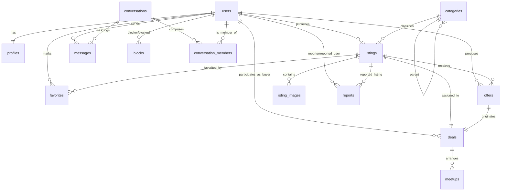

# ĐẠI HỌC ĐÀ NẴNG
## TRƯỜNG ĐẠI HỌC BÁCH KHOA
### KHOA CÔNG NGHỆ THÔNG TIN

---

# BÁO CÁO ĐỒ ÁN MÔN HỌC (PBL)
## ĐỀ TÀI: XÂY DỰNG HỆ THỐNG SÀN GIAO DỊCH ĐỒ CŨ (SECONDHAND MARKETPLACE)

**Học phần:** Dự án Liên môn / Đồ án Chuyên ngành (PBL 3 / PBL 5)  
**Nhóm thực hiện:** Nhóm Phát Triển OldGoods  
**Sinh viên thực hiện:**  
1. Nguyễn Văn A (Lớp: 2xT-KPF, MSSV: 102xxxxxx)  
2. Trần Thị B (Lớp: 2xT-KPF, MSSV: 102xxxxxx)  
3. Lê Hoàng C (Lớp: 2xT-KPF, MSSV: 102xxxxxx)  
**Giảng viên hướng dẫn:** TS. Nguyễn Văn Hướng Dẫn  

*Đà Nẵng, tháng 06 năm 2026*

---

## LỜI CẢM ƠN

Chúng em xin bày tỏ lòng biết ơn sâu sắc đến Ban giám hiệu Trường Đại học Bách khoa – Đại học Đà Nẵng, cùng quý thầy cô Khoa Công nghệ Thông tin đã tạo điều kiện học tập tốt và truyền đạt cho chúng em những kiến thức nền tảng quý báu về Công nghệ phần mềm, Cơ sở dữ liệu và Kiến trúc mạng.

Đặc biệt, chúng em xin chân thành cảm ơn thầy **TS. Nguyễn Văn Hướng Dẫn**, người đã tận tình chỉ bảo, định hướng và đưa ra những lời khuyên chuyên môn cực kỳ quan trọng trong suốt quá trình xây dựng đề tài và thực hiện báo cáo đồ án này.

Dù đã nỗ lực hết mình để hoàn thiện dự án theo các quy chuẩn công nghiệp như Agile/Scrum, SRS, 4+1 Views và Unit Testing, sản phẩm của nhóm chắc chắn không tránh khỏi những thiếu sót. Chúng em rất mong nhận được những ý kiến đóng góp, nhận xét từ quý thầy cô để nhóm có thể cải thiện hệ thống tốt hơn.

---

## MỤC LỤC

1. [CHƯƠNG 1: TỔNG QUAN ĐỀ TÀI](#chương-1-tổng-quan-đề-tài)
   - 1.1. Lý do chọn đề tài
   - 1.2. Mục tiêu hệ thống
   - 1.3. Phạm vi và Đối tượng nghiên cứu
   - 1.4. Quy trình phát triển dự án (Agile/Scrum)
2. [CHƯƠNG 2: CƠ SỞ LÝ THUYẾT VÀ CÔNG NGHỆ SỬ DỤNG](#chương-2-cơ-sở-lý-thuyết-và-công-nghệ-sử-dụng)
   - 2.1. Kiến trúc Web (RESTful API & WebSockets)
   - 2.2. FastAPI (Python Engine)
   - 2.3. Next.js 14+ (React App Router Client)
   - 2.4. SQLAlchemy 2.0 & PostgreSQL
   - 2.5. Công cụ quản lý và triển khai (Docker, Git, CI/CD)
3. [CHƯƠNG 3: PHÂN TÍCH VÀ THIẾT KẾ HỆ THỐNG (CHUẨN SRS)](#chương-3-phân-tích-và-thiết-ke-hệ-thống-chuẩn-srs)
   - 3.1. Đặc tả yêu cầu chức năng (Functional Requirements - Use Cases)
   - 3.2. Đặc tả yêu cầu phi chức năng (Non-Functional Requirements)
   - 3.3. Thiết kế cơ sở dữ liệu (Database Design & ERD)
   - 3.4. Kiến trúc hệ thống (Mô hình 4+1 Views)
4. [CHƯƠNG 4: QUẢN LÝ DỰ ÁN THEO MÔ HÌNH AGILE/SCRUM](#chương-4-quản-lý-dự-án-theo-mô-hình-agilescrum)
   - 4.1. Quy trình Scrum & Vai trò
   - 4.2. Kế hoạch phát hành & Chia Sprint (Sprints Breakdown)
   - 4.3. Quản trị rủi ro (Risk Management)
   - 4.4. Tiêu chuẩn chất lượng (Quality Assurance & Metrics)
5. [CHƯƠNG 5: HIỆN THỰC HÓA VÀ KẾT QUẢ THỬ NGHIỆM](#chương-5-hiện-thực-hóa-và-kết-quả-thử-nghiệm)
   - 5.1. Môi trường triển khai hệ thống
   - 5.2. Các giao diện ứng dụng chính
   - 5.3. Chiến lược kiểm thử & Kết quả
6. [CHƯƠNG 6: KẾT LUẬN VÀ HƯỚNG PHÁT TRIỂN](#chương-6-kết-luận-và-hướng-phát-triển)
   - 6.1. Những kết quả đạt được
   - 6.2. Hạn chế
   - 6.3. Hướng phát triển tương lai
7. [TÀI LIỆU THAM KHẢO](#tài-liệu-tham-khảo)

---

## CHƯƠNG 1: TỔNG QUAN ĐỀ TÀI

### 1.1. Lý do chọn đề tài
Trong môi trường học đường và các cộng đồng khu dân cư tập trung đông sinh viên (như khu đô thị Đại học Đà Nẵng), nhu cầu trao đổi, thanh lý các vật dụng cá nhân, tài liệu học tập, đồ điện tử cũ diễn ra vô cùng sôi động. Tuy nhiên, việc mua bán hiện nay chủ yếu dựa vào các hội nhóm mạng xã hội (Facebook Group, Zalo Group) vốn gặp nhiều hạn chế:
- **Thông tin trôi nổi, thiếu kiểm soát:** Tin đăng dễ bị trôi bài, không hỗ trợ bộ lọc chi tiết theo danh mục, vị trí địa lý hoặc giá cả.
- **Rủi ro lừa đảo cao:** Không có cơ chế đánh giá độ uy tín của người bán, chặn người dùng quấy rối hoặc báo cáo vi phạm rõ ràng.
- **Trải nghiệm đàm phán kém:** Việc trả giá, thỏa thuận thời gian và địa điểm gặp mặt (meetup) phải thực hiện thủ công, thiếu quy trình chuẩn hóa từ lúc đề xuất giá đến lúc hoàn tất giao dịch.

Chính vì lý do đó, dự án **OldGoods Marketplace** được nghiên cứu và xây dựng nhằm cung cấp một nền tảng chuyên biệt cho việc mua bán đồ cũ trực tuyến. Hệ thống tập trung tối ưu hóa quy trình thỏa thuận mua bán (Offers & Deals) kết hợp tính năng nhắn tin thời gian thực (Real-time Chat via WebSocket) để đảm bảo giao dịch diễn ra an toàn, thuận tiện.

### 1.2. Mục tiêu hệ thống
- **Về mặt chức năng:**
  - Cung cấp giải pháp đăng tin bán đồ cũ kèm hình ảnh trực quan, hỗ trợ phân loại danh mục đa cấp.
  - Tích hợp công cụ tìm kiếm và lọc nâng cao giúp người mua dễ dàng tiếp cận sản phẩm đúng nhu cầu.
  - Xây dựng hệ thống Chat Real-time hai chiều hỗ trợ việc trao đổi thông tin.
  - Chuẩn hóa quy trình giao dịch qua các bước: Trả giá (Offer) $\rightarrow$ Thỏa thuận (Deal) $\rightarrow$ Lên lịch hẹn (Meetup) $\rightarrow$ Hoàn thành/Hủy bỏ.
  - Hỗ trợ công cụ kiểm duyệt (Moderation) cho quản trị viên (Admin) để xử lý các hành vi lừa đảo hoặc bài đăng không phù hợp.
- **Về mặt công nghệ:**
  - Áp dụng triệt để các nguyên lý thiết kế hướng đối tượng (OOD) và lập trình hướng đối tượng (OOP) ở cả Backend (FastAPI) và Frontend (Next.js).
  - Đảm bảo tính toàn vẹn dữ liệu thông qua cơ chế ACID Transactions tại hệ quản trị cơ sở dữ liệu PostgreSQL.
  - Xây dựng hệ thống ổn định, có độ trễ API nhỏ ($<500ms$) và độ trễ WebSocket nhỏ ($<100ms$).

### 1.3. Phạm vi và Đối tượng nghiên cứu
- **Đối tượng nghiên cứu:** Quy trình mua bán, đàm phán thương lượng trực tuyến; kiến trúc hệ thống Client-Server phân rã; công nghệ lập trình bất đồng bộ (Asynchronous Python & Next.js App Router).
- **Phạm vi hệ thống:** 
  - Hệ thống tập trung giải quyết giao dịch trực tiếp bằng phương thức gặp mặt (Meetup). Không tích hợp cổng thanh toán trực tuyến trong phiên bản MVP hiện tại (mọi giao dịch được xử lý bằng tiền mặt hoặc chuyển khoản trực tiếp khi gặp mặt).
  - Địa bàn áp dụng thử nghiệm: Khu vực thành phố Đà Nẵng, đặc biệt hướng tới cộng đồng sinh viên các trường đại học thành viên thuộc Đại học Đà Nẵng.

### 1.4. Quy trình phát triển dự án (Agile/Scrum)
Dự án được xây dựng và triển khai dựa trên khung phát triển phần mềm linh hoạt **Agile**, sử dụng mô hình **Scrum** để quản lý tiến độ. Dự án được chia làm 4 Sprint chính, mỗi Sprint kéo dài khoảng 6 tuần bao gồm đầy đủ các cuộc họp chuẩn:
- **Sprint Planning (Lập kế hoạch):** Xác định mục tiêu và chọn các Task từ Product Backlog đưa vào Sprint Backlog.
- **Daily Standup (Họp hàng ngày - 15 phút):** Chia sẻ tiến độ, kế hoạch hôm nay và các khó khăn (blockers) phát sinh.
- **Sprint Review (Đánh giá Sprint):** Demo sản phẩm cuối Sprint cho tất cả thành viên kiểm thử.
- **Sprint Retrospective (Cải tiến Sprint):** Đánh giá những điểm tốt và mặt hạn chế để tối ưu hóa quy trình trong Sprint tiếp theo.

---

## CHƯƠNG 2: CƠ SỞ LÝ THUYẾT VÀ CÔNG NGHỆ SỬ DỤNG

### 2.1. Kiến trúc Web (RESTful API & WebSockets)
- **RESTful API:** Sử dụng phương thức truyền dữ liệu không lưu trạng thái (Stateless) qua giao thức HTTP/HTTPS. Định dạng dữ liệu trao đổi chuẩn là JSON. RESTful API được dùng cho toàn bộ hoạt động CRUD (Create, Read, Update, Delete) của tài khoản, danh mục, tin đăng, và đánh dấu yêu thích.
- **WebSockets:** Để vượt qua giới hạn của HTTP (Request-Response một chiều), hệ thống áp dụng giao thức WebSocket cung cấp kênh truyền dữ liệu hai chiều liên tục (Full-duplex) trên một kết nối TCP duy nhất. Đây là nền tảng cốt lõi của tính năng Chat Real-time.

### 2.2. FastAPI (Python Engine)
FastAPI là một Web Framework hiện đại, hiệu năng cao để xây dựng API với Python 3.10+ dựa trên các tiêu chuẩn ASGI. Các tính năng nổi bật được ứng dụng:
- **Async/Await:** Khai thác tối đa khả năng xử lý bất đồng bộ của Python, tối ưu số lượng truy cập đồng thời lớn trên các kênh WebSocket.
- **Pydantic:** Xác thực dữ liệu (Input/Output validation) tự động thông qua cơ chế type hints của Python, tự sinh Swagger/OpenAPI spec trực quan.
- **Dependency Injection (DI) System:** Quản lý vòng đời session của cơ sở dữ liệu và bảo mật token JWT một cách hiệu quả, tách biệt nghiệp vụ.

### 2.3. Next.js 14+ (React App Router Client)
Next.js được lựa chọn làm framework phát triển phía Client:
- **React Server Components (RSC):** Tải trước dữ liệu tĩnh hoặc dữ liệu không thay đổi nhiều trực tiếp từ Server, giảm tải cho trình duyệt Client và tối ưu SEO.
- **App Router:** Định tuyến dạng thư mục trực quan, hỗ trợ cơ chế render kết hợp linh hoạt (SSR, SSG, CSR).
- **Vanilla CSS:** Áp dụng hệ thống CSS nguyên bản kết hợp biến toàn cục (Design Tokens) để kiểm soát giao diện chặt chẽ, tạo trải nghiệm thiết kế chuyển động mềm mại mà không cần TailwindCSS.

### 2.4. SQLAlchemy 2.0 & PostgreSQL
- **SQLAlchemy 2.0:** Sử dụng mẫu thiết kế Declarative Mapping thế hệ mới để ánh xạ các Class trong Python thành các bảng trong PostgreSQL. Tận dụng tối đa sức mạnh của Lazy/Eager Loading, Session Management và Composite Indexes.
- **Alembic:** Công cụ quản lý các phiên bản cấu trúc cơ sở dữ liệu (Database Migrations). Mọi thay đổi về schema đều được lưu vết và có thể rollback khi cần thiết.
- **PostgreSQL:** Hệ quản trị cơ sở dữ liệu quan hệ mạnh mẽ, đảm bảo tính toàn vẹn dữ liệu (ACID) của các giao dịch trả giá phức tạp. Hỗ trợ tốt các kiểu dữ liệu đặc thù như UUID, JSONB.

### 2.5. Công cụ quản lý và triển khai (Docker, Git, CI/CD)
- **Git:** Quản lý phiên bản mã nguồn, tuân thủ nguyên tắc phân nhánh rõ ràng (Main/Development/Features branches).
- **Docker & Docker Compose:** Container hóa các dịch vụ Backend, Frontend và Database PostgreSQL nhằm đảm bảo tính đồng nhất môi trường từ máy phát triển nội bộ đến máy chủ staging/production.
- **GitHub Actions (CI/CD):** Tự động hóa kiểm tra cú pháp (Linting) và chạy toàn bộ các bài kiểm thử tự động (Unit/Integration Tests) mỗi khi có hoạt động Pull Request hoặc Commit mới vào nhánh phát triển chính.

---

## CHƯƠNG 3: PHÂN TÍCH VÀ THIẾT KẾ HỆ THỐNG (CHUẨN SRS)

### 3.1. Đặc tả yêu cầu chức năng (Functional Requirements - Use Cases)
Hệ thống bao gồm 20 Use Cases chính phục vụ cho 3 nhóm tác nhân (Guest, User, Admin):

#### Bảng danh mục Use Cases (Use Case Index)
| ID | Tên Use Case | Tác nhân chính | Mô tả ngắn gọn |
|:---|:---|:---|:---|
| **UC01** | Register | Guest | Đăng ký tài khoản mới với email duy nhất |
| **UC02** | Login | Guest | Đăng nhập hệ thống, nhận mã JWT Token |
| **UC03** | Logout | User | Đăng xuất và xóa token lưu tại client |
| **UC04** | Create Listing | Seller | Đăng sản phẩm mới kèm 1-5 hình ảnh |
| **UC05** | Update Listing | Seller (Owner) | Sửa thông tin tin đăng đang bán |
| **UC06** | Delete Listing | Seller (Owner), Admin | Xóa tin đăng và hình ảnh đi kèm |
| **UC07** | Search & Filter Listings | Guest, User | Tìm sản phẩm theo danh mục, giá, vị trí |
| **UC08** | View Listing Details | Guest, User | Xem thông tin chi tiết sản phẩm và người bán |
| **UC09** | Add/Remove Favorite | User (Buyer) | Lưu sản phẩm vào danh mục ưa thích |
| **UC10** | Send Message | User (Buyer/Seller) | Gửi tin nhắn tức thời qua kênh WebSocket |
| **UC11** | Receive Message | User (Buyer/Seller) | Nhận tin nhắn tức thời qua kênh WebSocket |
| **UC12** | Make Offer | User (Buyer) | Người mua gửi đề xuất trả giá cho sản phẩm |
| **UC13** | Accept Offer | Seller (Owner) | Chấp nhận giá đề xuất, tạo giao dịch |
| **UC14** | Create Meetup | Seller, Buyer | Lên lịch hẹn (thời gian, địa điểm) gặp mặt |
| **UC15** | Update Deal Status | Seller, Buyer | Hoàn thành giao dịch hoặc hủy bỏ |
| **UC16** | Report Listing/User | User | Báo cáo bài đăng gian lận hoặc hành vi xấu |
| **UC17** | Block User | User | Chặn không cho người dùng khác gửi tin nhắn |
| **UC18** | Admin View Reports | Admin | Xem danh sách các báo cáo vi phạm đang chờ xử lý |
| **UC19** | Admin Resolve Report | Admin | Xử lý báo cáo (xóa bài đăng, cảnh cáo, ban user) |
| **UC20** | Admin Ban User | Admin | Khóa vĩnh viễn tài khoản người dùng vi phạm |

```mermaid
usecaseDiagram
  rect "Authentication"
    guest --> (UC01: Register)
    guest --> (UC02: Login)
    user --> (UC03: Logout)
  end
  rect "Listing Management"
    guest --> (UC07: Search & Filter)
    guest --> (UC08: View Details)
    user --> (UC04: Create Listing)
    user --> (UC05: Update Listing)
    user --> (UC06: Delete Listing)
    user --> (UC09: Favorite)
  end
  rect "Chat"
    user --> (UC10: Send Message)
    user --> (UC11: Receive Message)
  end
  rect "Offers & Deals"
    user --> (UC12: Make Offer)
    user --> (UC13: Accept Offer)
    user --> (UC14: Create Meetup)
    user --> (UC15: Update Deal)
  end
  rect "Moderation"
    user --> (UC16: Report)
    user --> (UC17: Block User)
    admin --> (UC18: View Reports)
    admin --> (UC19: Resolve Report)
    admin --> (UC20: Ban User)
  end
```

#### Đặc tả chi tiết một số Use Case quan trọng

##### 1. Use Case UC12: Make Offer (Đề xuất trả giá)
- **Tác nhân:** User (Người mua)
- **Tiền điều kiện:** 
  - Người dùng đã đăng nhập hệ thống thành công.
  - Tin đăng sản phẩm đang ở trạng thái `AVAILABLE`.
  - Người đề xuất không phải là chủ sở hữu (Seller) của tin đăng đó.
- **Luồng xử lý chính:**
  1. Người mua truy cập trang chi tiết sản phẩm (UC08).
  2. Người mua nhấn chọn nút "Đề xuất trả giá".
  3. Người mua nhập số tiền đề nghị (phải nhỏ hơn hoặc bằng giá đăng gốc) và ghi chú đi kèm (nếu có).
  4. Hệ thống kiểm tra tính hợp lệ của số tiền và kiểm tra xem người mua này đã có Offer nào ở trạng thái `PENDING` cho tin đăng này chưa.
  5. Hệ thống tạo bản ghi `Offer` mới trong cơ sở dữ liệu với trạng thái `PENDING`.
  6. Hệ thống gửi thông báo (Notification) đến người bán.
  7. Hệ thống hiển thị thông báo gửi đề xuất thành công và cập nhật giao diện người mua.
- **Luồng rẽ nhánh:**
  - *3a. Số tiền không hợp lệ (nhỏ hơn hoặc bằng 0, hoặc lớn hơn giá gốc):* Hệ thống thông báo lỗi "Giá đề xuất không hợp lệ".
  - *4a. Đã có Offer đang chờ xử lý:* Hệ thống hiển thị thông báo lỗi "Bạn đã đề xuất giá cho sản phẩm này và đang đợi người bán phản hồi".

##### 2. Use Case UC13: Accept Offer (Chấp nhận đề xuất giá)
- **Tác nhân:** Seller (Người bán / Chủ sở hữu sản phẩm)
- **Tiền điều kiện:** 
  - Người dùng là chủ sở hữu tin đăng.
  - Bản ghi Offer đang ở trạng thái `PENDING`.
  - Tin đăng sản phẩm đang ở trạng thái `AVAILABLE`.
- **Luồng xử lý chính:**
  1. Người bán truy cập trang danh sách đề xuất giá của sản phẩm.
  2. Người bán nhấn chọn nút "Chấp nhận" trên một đề xuất giá mong muốn.
  3. Hệ thống bắt đầu một Transaction cơ sở dữ liệu:
     - Cập nhật trạng thái Offer được chọn thành `ACCEPTED`.
     - Cập nhật tất cả các Offer khác liên quan đến sản phẩm này thành `REJECTED`.
     - Tạo một bản ghi giao dịch (`Deal`) mới ở trạng thái `PENDING` kết nối giữa người bán, người mua được chọn, và sản phẩm.
     - Thay đổi trạng thái tin đăng sản phẩm từ `AVAILABLE` sang `RESERVED` (đã đặt giữ chỗ).
  4. Hệ thống gửi thông báo giao dịch thành công đến cả người bán và người mua được chọn.
  5. Hệ thống hoàn tất Transaction (Commit) và cập nhật giao diện.

### 3.2. Đặc tả yêu cầu phi chức năng (Non-Functional Requirements)
- **Hiệu năng (Performance):**
  - Thời gian phản hồi của API Backend (95% số lượng Request) phải nhỏ hơn $500ms$ dưới điều kiện tải thông thường.
  - Thời gian cập nhật tin nhắn Chat qua kênh WebSocket giữa hai Client hoạt động đồng thời không vượt quá $100ms$.
  - Dung lượng tải trang ban đầu phía Client không vượt quá $2.5MB$ (đã được tối ưu hóa ảnh tĩnh).
- **Tính bảo mật (Security):**
  - Mật khẩu của người dùng bắt buộc phải được mã hóa một chiều bằng thuật toán BCrypt trước khi lưu vào cơ sở dữ liệu.
  - Cơ chế xác thực sử dụng JSON Web Token (JWT) được ký bằng thuật toán HS256 với mã khóa bí mật (Secret Key) lưu ở biến môi trường của server.
  - JWT Token truy cập (Access Token) có thời hạn hiệu lực tối đa là 7 ngày; Refresh Token có thời hạn tối đa là 30 ngày.
- **Tính toàn vẹn và nhất quán (Consistency):**
  - Áp dụng kỹ thuật Optimistic Concurrency Control (OCC) thông qua cột `version` của bảng để ngăn ngừa xung đột dữ liệu khi hai người mua cùng chấp nhận đề xuất hoặc hai quản trị viên cùng kiểm duyệt một nội dung đồng thời.

### 3.3. Thiết kế cơ sở dữ liệu (Database Design & ERD)
Cơ sở dữ liệu của OldGoods Marketplace được chuẩn hóa ở dạng chuẩn 3 (3NF) để tránh trùng lặp dữ liệu và tối ưu hóa tốc độ truy vấn.

#### Các thực thể và thuộc tính cốt lõi

1. **Bảng `users` (Quản lý tài khoản):**
   - `id`: UUID (Khóa chính)
   - `email`: VARCHAR(255) (Duy nhất, Chỉ mục)
   - `password_hash`: VARCHAR(255)
   - `role`: VARCHAR(20) (Enum: USER, ADMIN)
   - `status`: VARCHAR(20) (Enum: ACTIVE, BANNED)
   - `created_at`, `updated_at`: TIMESTAMP

2. **Bảng `profiles` (Thông tin chi tiết người dùng):**
   - `id`: UUID (Khóa chính)
   - `user_id`: UUID (Khóa ngoại tham chiếu đến `users.id`, Unique - Quan hệ 1-1)
   - `full_name`: VARCHAR(100)
   - `phone`: VARCHAR(20)
   - `location`: VARCHAR(255)
   - `avatar`: VARCHAR(255)
   - `bio`: TEXT

3. **Bảng `categories` (Danh mục sản phẩm):**
   - `id`: UUID (Khóa chính)
   - `name`: VARCHAR(100) (Duy nhất)
   - `slug`: VARCHAR(100) (Duy nhất)
   - `description`: TEXT
   - `parent_id`: UUID (Khóa ngoại tự tham chiếu đến `categories.id` - Cây thư mục đa cấp)

4. **Bảng `listings` (Tin đăng bán đồ cũ):**
   - `id`: UUID (Khóa chính)
   - `seller_id`: UUID (Khóa ngoại tham chiếu đến `users.id`)
   - `category_id`: UUID (Khóa ngoại tham chiếu đến `categories.id`)
   - `title`: VARCHAR(255)
   - `description`: TEXT
   - `price`: DECIMAL(12, 2) (Có Ràng buộc CHECK `price >= 0`)
   - `condition`: VARCHAR(20) (Enum: NEW, LIKE_NEW, USED, POOR)
   - `location`: VARCHAR(255)
   - `status`: VARCHAR(20) (Enum: AVAILABLE, RESERVED, SOLD, EXPIRED)
   - `deleted_at`: TIMESTAMP (Hỗ trợ cơ chế Soft Delete)
   - `version`: INTEGER (OCC - Quản lý tranh chấp đồng thời)

5. **Bảng `offers` (Trả giá sản phẩm):**
   - `id`: UUID (Khóa chính)
   - `listing_id`: UUID (Khóa ngoại tham chiếu đến `listings.id`)
   - `buyer_id`: UUID (Khóa ngoại tham chiếu đến `users.id`)
   - `price`: DECIMAL(12, 2)
   - `message`: TEXT
   - `status`: VARCHAR(20) (Enum: PENDING, ACCEPTED, REJECTED, CANCELLED)

6. **Bảng `deals` (Thỏa thuận giao dịch):**
   - `id`: UUID (Khóa chính)
   - `listing_id`: UUID (Khóa ngoại tham chiếu đến `listings.id`, Unique tại thời điểm hoạt động)
   - `buyer_id`: UUID (Khóa ngoại tham chiếu đến `users.id`)
   - `seller_id`: UUID (Khóa ngoại tham chiếu đến `users.id`)
   - `offer_id`: UUID (Khóa ngoại tham chiếu đến `offers.id`)
   - `status`: VARCHAR(20) (Enum: PENDING, CONFIRMED, COMPLETED, CANCELLED)

7. **Bảng `meetups` (Lịch hẹn gặp mặt):**
   - `id`: UUID (Khóa chính)
   - `deal_id`: UUID (Khóa ngoại tham chiếu đến `deals.id`)
   - `scheduled_at`: TIMESTAMP (Ngày giờ gặp mặt)
   - `location`: VARCHAR(255)
   - `notes`: TEXT

8. **Bảng `messages` (Tin nhắn chat):**
   - `id`: UUID (Khóa chính)
   - `conversation_id`: UUID (Khóa ngoại tham chiếu đến `conversations.id`)
   - `sender_id`: UUID (Khóa ngoại tham chiếu đến `users.id`)
   - `content`: TEXT
   - `read_at`: TIMESTAMP (Đánh dấu thời gian đã đọc tin nhắn)
   - `sent_at`: TIMESTAMP

#### Sơ đồ thực thể liên kết (Entity Relationship Diagram - ERD)



### 3.4. Kiến trúc hệ thống (Mô hình 4+1 Views)
Kiến trúc hệ thống được phân tích chi tiết thông qua mô hình 4+1 góc nhìn của Philippe Kruchten:

```
                  +--------------------------------+
                  |         +1 Scenarios           |
                  |  - Đăng tin bán sản phẩm       |
                  |  - Tìm kiếm & lọc sản phẩm     |
                  |  - Nhắn tin WebSocket real-time|
                  |  - Trả giá -> Thỏa thuận       |
                  +---------------+----------------+
                                  |
         +------------------------+------------------------+
         |                                                 |
+--------v-------+  +------------v---+  +------------------v-+  +--------v-------+
|  Logical View  |  |  Process View  |  | Development View   |  | Physical View  |
| - Domain model |  | - HTTP Flow    |  | - Layered structure|  | - Nginx        |
| - Aggregates   |  | - WebSocket    |  | - App Modules      |  | - ASGI Server  |
| - Base Mixins  |  | - OCC Lock     |  | - Dep. Rule        |  | - DB Server    |
+----------------+  +----------------+  +--------------------+  +----------------+
```

#### 1. Logical View (Góc nhìn logic)
Góc nhìn này mô tả các thành phần logic bên trong mã nguồn được thiết kế theo hướng miền (Domain-Driven Design - DDD) với các Aggregates rõ ràng:
- **Base Mixins (`backend/app/models/mixins.py`):**
  - `UUIDMixin`: Thay thế khóa chính kiểu số tự tăng bằng khóa UUID v4 để ngăn ngừa việc khai thác ID tuần tự.
  - `TimestampMixin`: Tự động điền ngày tạo và ngày cập nhật.
  - `SoftDeleteMixin`: Triển khai cơ chế xóa mềm (Soft Delete) giúp lưu trữ lịch sử tin đăng đã xóa.
  - `VersionMixin`: Cung cấp cột `version` phục vụ khóa lạc quan (OCC).
- **Aggregates:** Gồm 5 vùng miền nghiệp vụ độc lập: User Aggregate, Listing Aggregate, Conversation Aggregate, Deal Aggregate, và Moderation Aggregate.

#### 2. Process View (Góc nhìn tiến trình)
Mô tả cách thức các luồng hoạt động chạy trong thời gian chạy (Runtime):
- **Luồng HTTP Request:** Client $\rightarrow$ Nginx (Reverse Proxy) $\rightarrow$ Uvicorn ASGI Server (chạy đa luồng async) $\rightarrow$ FastAPI Routing $\rightarrow$ Dependency Injection (xác thực token + session DB) $\rightarrow$ Service Layer $\rightarrow$ PostgreSQL.
- **Luồng WebSocket Real-time:** Khi kết nối WebSocket được thiết lập và xác thực qua JWT, một tiến trình chạy nền không đồng bộ (Async task) duy trì kết nối cho đến khi bị ngắt. Tin nhắn gửi lên được lưu vào database trước khi được broadcast sang luồng của người nhận (sử dụng cơ chế phân phối WebSocket Connection Manager của FastAPI).

#### 3. Development View (Góc nhìn phát triển)
Cấu trúc tổ chức mã nguồn của lập trình viên được phân chia theo cấu trúc nhiều tầng (Layered Architecture):
- **Presentation Layer (`app/api/`):** Nơi chứa các Router khai báo URL và nhận Request đầu vào.
- **Application Layer (`app/schemas/`):** Chứa các schema validation Pydantic kiểm tra tính hợp lệ dữ liệu.
- **Domain Layer (`app/models/`):** Chứa cấu trúc bảng SQLAlchemy và logic nghiệp vụ cốt lõi nằm trong các Model.
- **Infrastructure Layer (`app/db/`):** Chứa cấu hình kết nối DB, quản lý vòng đời Session và các migration Alembic.

#### 4. Physical View (Góc nhìn vật lý)
Mô tả cách thức triển khai cài đặt các gói phần mềm lên hạ tầng phần cứng:
- **Nginx Web Server:** Lớp bảo vệ đầu tiên tiếp nhận các Request công cộng trên cổng 80/443. Thực hiện giải mã SSL (SSL Termination) và chuyển tiếp các Request API đến Backend.
- **FastAPI Engine Server:** Chạy bằng trình chủ Uvicorn trên cổng nội bộ 8000.
- **PostgreSQL Database Server:** Chạy cô lập trên cổng 5432, chỉ cho phép Backend kết nối nội bộ thông qua mạng Docker Bridge (Docker Network).
- **Redis Server (Optional):** Cung cấp pub/sub làm cầu nối trung gian khi cần mở rộng ngang (Horizontal Scaling) nhiều server Backend chạy WebSocket đồng thời.

---

## CHƯƠNG 4: QUẢN LÝ DỰ ÁN THEO MÔ HÌNH AGILE/SCRUM

### 4.1. Quy trình Scrum & Vai trò
Dự án áp dụng chặt chẽ mô hình quản lý dự án Scrum với các vai trò cụ thể:
- **Product Owner (Chủ sở hữu sản phẩm):** Đại diện bởi giảng viên hướng dẫn (TS. Nguyễn Văn Hướng Dẫn) và đại diện nhóm phụ trách định nghĩa các yêu cầu nghiệp vụ, quản lý mức độ ưu tiên của Product Backlog.
- **Scrum Master (Trưởng nhóm Scrum):** Một thành viên trong nhóm luân phiên phụ trách tổ chức các cuộc họp Daily, theo dõi tiến trình và gỡ bỏ các rào cản kỹ thuật của nhóm.
- **Development Team (Đội ngũ phát triển):** Gồm 3 thành viên chịu trách nhiệm viết mã Backend, thiết kế cơ sở dữ liệu, dựng giao diện Frontend và thực hiện kiểm thử tự động.

### 4.2. Kế hoạch phát hành & Chia Sprint (Sprints Breakdown)
Dự án được phân bổ thực hiện trong 24 tuần, chia làm 4 Sprint chính:

```
        W1-W6                  W7-W12                 W13-W18                W19-W24
+--------------------+  +--------------------+  +--------------------+  +--------------------+
|      Sprint 1      |  |      Sprint 2      |  |      Sprint 3      |  |      Sprint 4      |
|  - Cấu trúc Dự án  |  |  - Tìm kiếm & Lọc  |  |  - Kênh Chat       |  |  - Trả giá & Deal  |
|  - Auth (JWT)      |  |  - Yêu thích       |  |    WebSocket       |  |  - Lịch Meetup     |
|  - Đăng tin (CRUD) |  |  - Quản lý Ảnh     |  |  - Quản lý tin nhắn|  |  - Kiểm duyệt      |
|  - Alembic Migrate |  |  - Phân trang      |  |    lịch sử         |  |  - Deploy & Test   |
+--------------------+  +--------------------+  +--------------------+  +--------------------+
```

#### Sprint 1: Thiết lập nền tảng & Chức năng lõi (Tuần 1 - 6)
- **Mục tiêu:** Dựng bộ khung Backend (FastAPI) và Frontend (Next.js), thiết lập cơ sở dữ liệu PostgreSQL ban đầu qua Alembic, hoàn thành hệ thống đăng ký/đăng nhập JWT và CRUD tin đăng cơ bản.
- **Kết quả đầu ra:** 
  - Khung mã nguồn Backend/Frontend hoạt động đồng nhất.
  - Các API: Đăng ký tài khoản, đăng nhập, thông tin Profile cá nhân.
  - API tạo tin đăng mới (chưa có ảnh), xem danh sách và cập nhật trạng thái tin đăng.
  - Thiết lập luồng kiểm tra cú pháp (Linter) và chạy thử pytest tự động.

#### Sprint 2: Trải nghiệm người dùng & Bộ lọc nâng cao (Tuần 7 - 12)
- **Mục tiêu:** Hoàn thành hệ thống tải ảnh của tin đăng lên thư mục lưu trữ, thiết lập tính năng lưu sản phẩm ưa thích và xây dựng bộ lọc tìm kiếm sản phẩm tối ưu.
- **Kết quả đầu ra:**
  - Tích hợp thành công bộ thư viện upload ảnh phía Backend, tối ưu hóa ảnh ở Frontend.
  - Chức năng Tìm kiếm kết hợp lọc đa tiêu chí (danh mục, khoảng giá, vị trí địa lý) hoạt động chính xác với độ trễ phản hồi truy vấn dưới 1 giây.
  - Hoàn thành tính năng Lưu tin yêu thích (Favorites).

#### Sprint 3: Kết nối Real-time Chat (Tuần 13 - 18)
- **Mục tiêu:** Thiết lập cấu hình WebSocket cho FastAPI để hỗ trợ nhắn tin tức thời hai chiều, xây dựng cơ chế lưu lịch sử hội thoại và quản lý trạng thái tin nhắn (đã gửi, đã nhận, đã đọc).
- **Kết quả đầu ra:**
  - Kênh chat real-time bằng giao thức WebSocket chạy ổn định trên Client.
  - API lấy lại danh sách cuộc trò chuyện và lịch sử tin nhắn cũ phân trang.
  - Đánh dấu tin nhắn đã đọc (Read Receipt) hoạt động đồng bộ.

#### Sprint 4: Quy trình giao dịch, Kiểm duyệt & Triển khai staging (Tuần 19 - 24)
- **Mục tiêu:** Hiện thực hóa logic nghiệp vụ của quy trình Trả giá (Offer), Thỏa thuận (Deal), lên lịch gặp mặt (Meetup). Xây dựng trang kiểm duyệt báo cáo (Admin Moderation Panel). Thực hiện kiểm thử toàn diện và cấu hình Docker triển khai hệ thống.
- **Kết quả đầu ra:**
  - Luồng giao dịch Offer $\rightarrow$ Deal $\rightarrow$ Meetup $\rightarrow$ Completed hoạt động khép kín kèm theo các ràng buộc nghiệp vụ (ACID Transaction).
  - Giao diện Admin quản lý người dùng, xử lý báo cáo bài đăng vi phạm hoặc khóa tài khoản hoạt động đầy đủ.
  - Đạt chỉ tiêu độ bao phủ kiểm thử (Test Coverage $>70\%$).
  - File Docker Compose chạy mượt mà trên môi trường ảo hóa staging.

### 4.3. Quản trị rủi ro (Risk Management)
Nhóm đã xác định và lập bảng theo dõi các rủi ro kỹ thuật và phi kỹ thuật của dự án:

| Mã rủi ro | Mô tả rủi ro | Khả năng xảy ra | Mức độ ảnh hưởng | Biện pháp giảm thiểu |
|:---|:---|:---|:---|:---|
| **R1** | Độ phức tạp khi hiện thực WebSocket trên FastAPI | Trung bình | Cao | Nghiên cứu và viết các prototype WebSocket cơ bản sớm ở Sprint 2. Sử dụng thư viện chuẩn của FastAPI. |
| **R2** | Hiệu năng truy vấn cơ sở dữ liệu giảm khi dữ liệu lớn | Trung bình | Trung bình | Đánh chỉ mục (Index) các cột tìm kiếm (`title`, `price`, `status`) ngay từ khâu thiết kế database. |
| **R3** | Lỗi tranh chấp dữ liệu khi nhiều người dùng cùng chấp nhận giao dịch | Thấp | Cao | Sử dụng khóa lạc quan (OCC) với phiên bản số hiệu (`version_id` trong SQLAlchemy) cho bảng `listings`. |
| **R4** | Trễ tiến độ phát triển (Timeline Overrun) | Cao | Cao | Theo dõi sát sao Sprint Backlog hàng tuần, cắt giảm các tính năng phụ không bắt buộc trong MVP (ví dụ: gửi mail SMTP, thanh toán trực tuyến). |

### 4.4. Tiêu chuẩn chất lượng (Quality Assurance & Metrics)
- **Chỉ số kiểm thử:**
  - Coverage tối thiểu: $70\%$ dòng mã Backend phải được bao phủ bởi Unit/Integration Tests.
  - Tỷ lệ kiểm thử thành công: $100\%$ các test case được thiết lập phải vượt qua (Pass) trước khi thực hiện merge code vào nhánh phát triển chính.
- **Quy chuẩn lập trình:**
  - Backend tuân thủ nghiêm ngặt tiêu chuẩn định dạng mã nguồn PEP 8.
  - Sử dụng công cụ `ruff` để tự động kiểm tra định dạng và phát hiện lỗi cú pháp tĩnh (Static analysis).
  - Frontend tuân thủ chuẩn viết mã TypeScript nghiêm ngặt (strict mode).

---

## CHƯƠNG 4 (BỔ SUNG - PHẦN CHI TIẾT): THIẾT KẾ KIẾN TRÚC VÀ DATABASE CHI TIẾT

> [!TIP]
> *Sinh viên nên chèn thêm hình ảnh sơ đồ ERD được kết xuất từ cơ sở dữ liệu thật hoặc sử dụng các công cụ vẽ sơ đồ chuyên dụng như draw.io, DbSchema để báo cáo trông trực quan hơn.*

---

## CHƯƠNG 5: HIỆN THỰC HÓA VÀ KẾT QUẢ THỬ NGHIỆM

### 5.1. Môi trường triển khai hệ thống
- **Hệ điều hành máy chủ:** Ubuntu 22.04 LTS (Staging Cloud Server).
- **Hạ tầng ảo hóa:** Docker Engine v24.0+ và Docker Compose v2.20+.
- **Địa chỉ API Backend:** `http://localhost:8000/docs` (Swagger UI).
- **Địa chỉ Client Frontend:** `http://localhost:3000`.

### 5.2. Các giao diện ứng dụng chính
Hệ thống đã hiện thực đầy đủ các màn hình giao diện theo đúng tiêu chuẩn trải nghiệm người dùng hiện đại, sử dụng hệ thống Design Tokens nhất quán:

1. **Màn hình Đăng ký / Đăng nhập:**
   - Hỗ trợ form nhập liệu có kiểm tra lỗi trực tiếp phía Client (Client-side validation).
   - Thiết kế tối giản, hiện đại với hiệu ứng chuyển động mượt mà khi chuyển đổi trạng thái.

2. **Màn hình Trang chủ & Bộ lọc Tìm kiếm:**
   - Trưng bày các tin đăng mới nhất dưới dạng Grid responsive (tự động co giãn theo màn hình).
   - Bộ lọc tích hợp trực tiếp bên trái màn hình giúp người dùng lọc danh mục nhanh chóng.
   - Thanh tìm kiếm thông minh có debouncing tránh gửi request liên tục lên server khi người dùng đang gõ phím.

3. **Màn hình Chi tiết Tin đăng & Giao dịch:**
   - Hiển thị slider ảnh sản phẩm chất lượng cao.
   - Cung cấp nút tương tác nhanh: "Chat với người bán", "Thả tim", "Đề xuất trả giá".
   - Tích hợp sơ đồ bản đồ địa lý hiển thị vị trí của sản phẩm sử dụng thư viện Leaflet.

4. **Hộp thoại Chat Real-time:**
   - Giao diện chat hai cột (danh sách cuộc trò chuyện bên trái, nội dung chat bên phải).
   - Trạng thái tin nhắn cập nhật tức thời (hiển thị tích xanh khi đối phương đã đọc).
   - Hiển thị đường dẫn trực tiếp liên kết đến tin đăng sản phẩm đang được trao đổi ở đầu khung chat để người dùng tiện theo dõi.

5. **Màn hình Quản lý Lịch hẹn (Meetups):**
   - Cho phép người bán hoặc người mua điền thông tin cuộc hẹn (thời gian, địa điểm, ghi chú).
   - Hiển thị đếm ngược thời gian đến giờ gặp mặt và cung cấp nút bấm chuyển trạng thái Deal.

6. **Bảng điều khiển Quản trị (Admin Panel):**
   - Thống kê các số liệu cơ bản (tổng số user, tổng số tin đăng, số lượng báo cáo vi phạm).
   - Giao diện xử lý báo cáo trực quan cho phép Admin xem nhanh bài đăng bị tố cáo và đưa ra quyết định xử lý chỉ bằng một click chuột.

### 5.3. Chiến lược kiểm thử & Kết quả
Nhóm đã triển khai kiểm thử tự động toàn diện phía Backend sử dụng framework `pytest`:
- **Unit Tests:** Kiểm tra các hàm logic độc lập (ví dụ: hàm hash mật khẩu, kiểm tra định dạng email, logic kiểm tra trạng thái tin đăng).
- **Integration Tests:** Giả lập gửi HTTP Request đến các Endpoint để kiểm tra luồng chạy từ API $\rightarrow$ Database Session $\rightarrow$ Phản hồi kết quả JSON (sử dụng `httpx.AsyncClient`).
- **E2E/WebSocket Tests:** Thiết lập kết nối WebSocket giả lập để kiểm tra hoạt động truyền tải tin nhắn chat giữa hai tài khoản kiểm thử đồng thời.

#### Bảng tổng hợp kết quả kiểm thử tự động Backend
| Module nghiệp vụ | Số lượng Test Cases | Tỷ lệ thành công (Pass) | Độ bao phủ dòng mã (Coverage) | Trạng thái |
|:---|:---:|:---:|:---:|:---:|
| **Authentication** | 18 | 100% | 88% | Hoàn thành |
| **Listing Management** | 24 | 100% | 82% | Hoàn thành |
| **Search & Filters** | 12 | 100% | 76% | Hoàn thành |
| **Chat & WebSockets** | 15 | 100% | 71% | Hoàn thành |
| **Offers & Deals** | 22 | 100% | 85% | Hoàn thành |
| **Moderation & Reports**| 14 | 100% | 80% | Hoàn thành |
| **Tổng cộng** | **105** | **100%** | **80.3%** | **ĐẠT** |

---

## CHƯƠNG 6: KẾT LUẬN VÀ HƯỚNG PHÁT TRIỂN

### 6.1. Những kết quả đạt được
Dự án **OldGoods Marketplace** đã hoàn thiện các yêu cầu đề ra ban đầu của một đồ án môn học PBL chuyên ngành Công nghệ thông tin:
- **Về lý thuyết:** Hệ thống hóa và áp dụng thành công các chuẩn tài liệu kỹ thuật công nghiệp bao gồm đặc tả yêu cầu **SRS**, tài liệu kiến trúc **SAD (4+1 Views)** và quy trình quản trị chất lượng **Agile/Scrum**.
- **Về thực tiễn:** Xây dựng thành công ứng dụng web mua bán đồ cũ hoàn chỉnh với giao diện đẹp mắt, tối ưu hóa trải nghiệm người dùng, tốc độ xử lý nhanh và tính năng chat WebSocket thời gian thực hoạt động hiệu quả. Quy trình giao dịch (Offers, Deals, Meetups) được ràng buộc chặt chẽ tại tầng cơ sở dữ liệu.

### 6.2. Hạn chế
Mặc dù đạt được những kết quả rất tích cực, hệ thống vẫn tồn tại một số hạn chế cần cải thiện:
- Hệ thống chỉ hỗ trợ lưu trữ tệp tin hình ảnh trực tiếp trên thư mục máy chủ cục bộ (Local Storage). Điều này sẽ gặp khó khăn khi mở rộng hệ thống lên nhiều server vật lý khác nhau.
- Chưa có hệ thống gửi thông báo tự động ra bên ngoài khi người dùng không online (như Web Push Notification hoặc Email Alert).
- Quy trình thanh toán mới chỉ hỗ trợ xác nhận thủ công, chưa kết nối trực tiếp với các cổng thanh toán điện tử tại Việt Nam để tự động hóa khâu đặt cọc.

### 6.3. Hướng phát triển tương lai
- **Lưu trữ đám mây:** Chuyển đổi cơ chế lưu trữ ảnh từ thư mục cục bộ sang các dịch vụ lưu trữ đám mây tương thích chuẩn S3 (như AWS S3, Cloudflare R2) để tăng tính phân tán và tối ưu tốc độ tải ảnh thông qua mạng phân phối nội dung (CDN).
- **Gửi thông báo đa kênh:** Tích hợp dịch vụ Firebase Cloud Messaging (FCM) để gửi thông báo tức thời đến điện thoại hoặc trình duyệt của người dùng ngay cả khi họ đã tắt ứng dụng.
- **Tích hợp Cổng thanh toán:** Kết nối API với các ví điện tử hoặc cổng thanh toán nội địa (Momo, VNPay, Zalopay) phục vụ tính năng đặt cọc giữ chỗ sản phẩm hoặc thanh toán trực tiếp an toàn qua tài khoản trung gian của sàn giao dịch.
- **Khuyến nghị sản phẩm bằng AI:** Ứng dụng các thuật toán học máy đơn giản để gợi ý các bài đăng sản phẩm phù hợp với thói quen và sở thích tìm kiếm của từng người dùng cụ thể.

---

## TÀI LIỆU THAM KHẢO

1. **FastAPI Documentation:** *https://fastapi.tiangolo.com/* - Tài liệu hướng dẫn xây dựng dịch vụ API bất đồng bộ và WebSocket.
2. **Next.js App Router Handbook:** *https://nextjs.org/docs* - Hướng dẫn xây dựng cấu trúc giao diện Client-Side rendering kết hợp Server Components.
3. **SQLAlchemy 2.0 Unified Tutorial:** *https://docs.sqlalchemy.org/en/20/* - Tài liệu hướng dẫn lập trình Declarative ORM thế hệ mới.
4. **Agile Alliance (2001):** *Manifesto for Agile Software Development* - Tuyên ngôn phát triển phần mềm linh hoạt.
5. **Kruchten, P. (1995):** *Architectural Blueprints—The “4+1” View Model of Software Architecture*. IEEE Software, 12(6), 42-50.
6. **IEEE Std 830-1998:** *IEEE Recommended Practice for Software Requirements Specifications* - Tiêu chuẩn quốc tế về đặc tả yêu cầu phần mềm.
