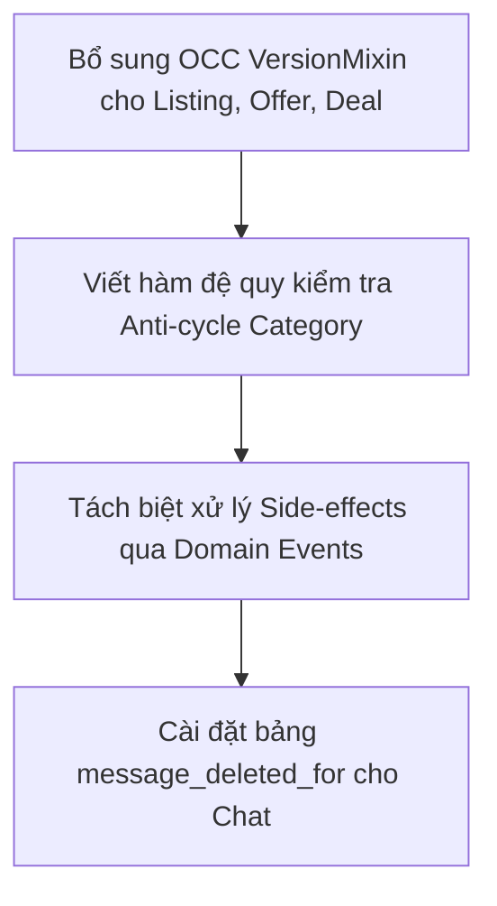

# 📋 Báo Cáo Phân Tích Kỹ Thuật & Kế Hoạch Cải Tiến Hệ Thống (Client - Server)

Báo cáo này tập trung phân tích các yêu cầu kỹ thuật về thiết kế hướng đối tượng (OOD/OOP) hướng tới tiêu chuẩn Production-Grade cho hệ thống backend (SQLAlchemy/FastAPI) và đánh giá chất lượng UI/UX, mã nguồn của frontend (Next.js). Đồng thời, đề xuất một kế hoạch cải tiến hệ thống toàn diện.

---

## 🔍 Phần 1: Phân Tích Các Yêu Cầu Kỹ Thuật OOD/OOP & Database

Nhận xét của giảng viên đưa ra các tiêu chuẩn rất cao đối với thiết kế phần mềm hướng đối tượng trong Python/SQLAlchemy:

1.  **Đóng gói (Encapsulation):**
    *   *Mạng lưới trạng thái chặt chẽ:* Không sử dụng chuỗi tự do (free strings), thay thế bằng các `Enum` có kiểu dữ liệu tường minh để tránh sai sót chính tả khi giao tiếp mạng.
    *   *Entity có hành vi (Rich Domain Model):* Logic nghiệp vụ cốt lõi phải nằm trong các thực thể (entities), thay vì xây dựng các lớp Anemic (chỉ chứa dữ liệu).
    *   *Bảo vệ tính toàn vẹn (Guards & Invariants):* Sử dụng các phương thức có kiểm tra ràng buộc trước khi thay đổi trạng thái (ví dụ: chỉ cho phép chấp nhận các Offer đang ở trạng thái `PENDING`). Sử dụng `CheckConstraint` và `@validates` để xác thực dữ liệu tại cả tầng ứng dụng và tầng cơ sở dữ liệu (ví dụ: `price >= 0`).
2.  **Thừa kế (Inheritance):**
    *   Sử dụng Mixins để tái sử dụng mã nguồn cho các trường thuộc tính chung như khóa chính (`UUIDMixin`), nhật ký thời gian (`TimestampMixin`), và cơ chế xóa mềm (`SoftDeleteMixin`).
    *   Duy trì một lớp cơ sở (`DeclarativeBase`) duy nhất để quản lý vòng đời và ánh xạ bảng.
3.  **Đa hình (Polymorphism):**
    *   Tự động áp dụng bộ lọc xóa mềm cho mọi truy vấn SELECT đối với các lớp kế thừa `SoftDeleteMixin` thông qua sự kiện `do_orm_execute` và hàm `with_loader_criteria` của SQLAlchemy.
4.  **Trừu tượng (Abstraction):**
    *   Sử dụng các lớp Mixin làm lớp trừu tượng ngang (cross-cutting concerns).
    *   Tách biệt trách nhiệm giữa tầng mô hình (Domain Model) và tầng dịch vụ (Service Layer) để mã nguồn dễ bảo trì và kiểm thử.

---

## 📊 Phần 2: Đánh Giá Chi Tiết Hiện Trạng Hệ Thống Backend

Qua đối chiếu và kiểm tra thực tế mã nguồn trong thư mục `backend/app/`, dưới đây là đánh giá chi tiết:

### 1. Những Điểm Đã Đạt Được (Fully Achieved)
*   **Hệ thống Enum chuẩn hóa:** Tất cả các trạng thái, điều kiện, vai trò trong dự án (như `UserRole`, `UserStatus`, `ListingStatus`, `ItemCondition`, `OfferStatus`, `DeliveryStatus`, `DealStatus`, `MeetupStatus`, `ReportStatus`, `ReportTargetType`) đều được định nghĩa rõ ràng dưới dạng Python Enum trong [enums.py](file:///d:/User/Workspace/secondhand-marketplace/backend/app/models/enums.py) và ánh xạ sang database bằng `SAEnum`.
*   **Logic nghiệp vụ đặt tại Domain Model (Rich Domain):**
    *   [listing.py](file:///d:/User/Workspace/secondhand-marketplace/backend/app/models/listing.py): `Listing` đóng gói các hành vi `is_available()`, `reserve()`, `mark_sold()`, `reopen()`.
    *   [transaction.py](file:///d:/User/Workspace/secondhand-marketplace/backend/app/models/transaction.py): `Offer` tự thực hiện logic `accept()` (sinh ra Deal mới, chuyển Listing sang `RESERVED`), `decline()`, `cancel()`. `Deal` đóng gói `complete()` và `cancel()`.
*   **Kiểm tra ràng buộc & Bảo vệ toàn vẹn dữ liệu (Guards & Invariants):**
    *   Tất cả các hành vi thay đổi trạng thái đều có câu lệnh kiểm tra (Guard clauses) trước khi xử lý, ném ra ngoại lệ `ValueError` nếu trạng thái không hợp lệ.
    *   Ràng buộc cứng tại DB: Áp dụng `CheckConstraint("price >= 0")` cho cả `Listing` và `Offer`, `CheckConstraint("agreed_price >= 0")` cho `Deal`, và `CheckConstraint("rating >= 1 AND rating <= 5")` cho `Review`.
*   **Thiết kế Cascade cẩn trọng:**
    *   Khi xóa một `User`, hệ thống sẽ tự động xóa sạch `Profile` tương ứng (`cascade="all, delete-orphan"`).
    *   Tuy nhiên, quan hệ giữa `User` và `Offer` / `Deal` sử dụng ràng buộc `ondelete="RESTRICT"` và không cấu hình cascade. Điều này ngăn chặn việc vô tình xóa mất lịch sử giao dịch và tài chính khi người dùng bị xóa hoặc khóa.
*   **Bộ lọc Xóa mềm Toàn cục (Global Soft Delete Filter):**
    *   Cơ chế sự kiện `do_orm_execute` kết hợp `with_loader_criteria` đã được cài đặt chính xác trong [session.py](file:///d:/User/Workspace/secondhand-marketplace/backend/app/db/session.py#L29-L41). Mọi truy vấn mặc định sẽ tự động bỏ qua các bản ghi có `deleted_at IS NOT NULL` trừ khi lập trình viên chỉ định tùy chọn `execution_options(include_deleted=True)`.

### 2. Những Điểm Xây Dựng Khác Biệt Nhưng Tương Đương (Alternative Implementations)
*   **Khả năng tương thích chéo cơ sở dữ liệu (SQLite & PostgreSQL):**
    Thay vì khai báo cứng kiểu dữ liệu `UUID` và `JSONB` của PostgreSQL (sẽ gây lỗi khi chạy thử nghiệm trên SQLite cục bộ), mã nguồn đã định nghĩa các kiểu dữ liệu thông minh trong [mixins.py](file:///d:/User/Workspace/secondhand-marketplace/backend/app/models/mixins.py#L11-L30):
    *   `SafeUUID` tự động chuyển đổi giữa String (SQLite) và UUID (Postgres).
    *   `JSONBSqlType` sử dụng `JSON` cho SQLite và `JSONB` cho Postgres thông qua `.with_variant()`.
    *Đây là giải pháp tuyệt vời giúp lập trình viên phát triển cục bộ cực kỳ nhanh chóng bằng SQLite mà không bắt buộc phải cài đặt PostgreSQL trên máy cá nhân.*

### 3. Những Điểm Hoàn Thành Vượt Trội (Exceeded Expectations)
*   **Meetup Check-in Workflow:**
    Hẹn gặp giao dịch (`Meetup`) hỗ trợ tính năng hai bên cùng check-in (`buyer_checked_in`, `seller_checked_in`). Khi cả hai đều điểm danh thành công, hệ thống tự động hoàn thành giao dịch và đánh dấu sản phẩm đã bán (`ListingStatus.SOLD`).
*   **Quy trình Giao hàng & Khiếu nại (Delivery & Dispute):**
    Hỗ trợ đầy đủ luồng vận chuyển thương mại điện tử với trạng thái giao hàng, mã vận đơn, và cơ chế gửi khiếu nại (`Dispute`) nếu sản phẩm có lỗi, giúp hệ thống đạt mức độ tiệm cận thực tế.
*   **Cơ chế Ngăn chặn Chặn chéo / Theo dõi chéo (Blocks/Follows Constraints):**
    *   [moderation.py](file:///d:/User/Workspace/secondhand-marketplace/backend/app/models/moderation.py): Ràng buộc `blocker_id <> blocked_id` đảm bảo người dùng không thể tự chặn chính mình.
    *   [social.py](file:///d:/User/Workspace/secondhand-marketplace/backend/app/models/social.py): Ràng buộc `follower_id != following_id` đảm bảo không tự theo dõi chính mình.

### 4. Những Điểm Chưa Đạt Được / Gaps (Missing Features)
*   **Chưa sử dụng OCC Mixin (Optimistic Concurrency Control):**
    Mặc dù lớp `VersionMixin` đã được định nghĩa trong [mixins.py](file:///d:/User/Workspace/secondhand-marketplace/backend/app/models/mixins.py#L79-L81), **không có bất kỳ mô hình nào kế thừa nó**. Trong môi trường sản xuất thực tế, việc thiếu khóa lạc quan (OCC) trên `Listing`, `Offer`, hoặc `Deal` dễ dẫn đến xung đột ghi dữ liệu song song (ví dụ: hai người cùng chấp nhận một đề xuất giá hoặc mua một mặt hàng tại cùng một thời điểm).
*   **Thiếu cơ chế ngăn chặn chu kỳ danh mục (Anti-cycle Category Guard):**
    Mô hình danh mục (`Category`) tự tham chiếu bằng `parent_id`. Tuy nhiên, trong [listings.py](file:///d:/User/Workspace/secondhand-marketplace/backend/app/services/listings.py#L14-L19) không có cơ chế kiểm tra tính tuần hoàn. Một người dùng có thể tạo một chu kỳ vô hạn (ví dụ: Category A có cha là B, B lại có cha là A), dẫn đến treo server do đệ quy vô hạn khi tải cây danh mục.
*   **Chưa có Domain Events:**
    Các nghiệp vụ như chấp nhận Offer, hoàn thành Deal đang được viết gộp chung trong một giao dịch cơ sở dữ liệu. Việc thiếu cơ chế Domain Events (như `OfferAcceptedEvent`, `DealCompletedEvent`) khiến mã nguồn bị bó chặt (tightly coupled) và khó mở rộng các tính năng phụ trợ (ví dụ: gửi thông báo Real-time, gửi email xác nhận, ghi nhật ký kiểm toán).
*   **Xóa tin nhắn toàn cục thay vì xóa theo từng người dùng:**
    Hiện tại, tin nhắn (`Message`) kế thừa `SoftDeleteMixin`. Khi một người dùng bấm xóa tin nhắn, tin nhắn đó biến mất hoàn toàn đối với cả hai bên trong cuộc trò chuyện. Tiêu chuẩn nghiệp vụ thông thường yêu cầu tin nhắn chỉ ẩn đi đối với người xóa và vẫn hiển thị đối với người còn lại (đòi hỏi bảng liên kết trung gian `message_deleted_for`).

---

## 🎨 Phần 3: Đánh Giá Chi Tiết Giao Diện UI/UX & Frontend

Qua kiểm tra cấu trúc mã nguồn của Frontend Next.js (thư mục `frontend/src/`):

### 1. Đánh giá về Liên kết và Luồng Người dùng (User Flow)
*   **Luồng hoạt động chuẩn xác:** Việc kết nối giữa các màn hình rất mượt mà:
    *   Người dùng tìm sản phẩm tại Trang chủ ➔ Xem chi tiết sản phẩm tại `/listings/[listingId]` ➔ Bấm Chat để mở Hộp thư `/inbox` hoặc bấm Đề xuất giá để mở `/dashboard/offers`.
    *   Trang Profile `/profile` liên kết trực tiếp tới `/profile/recycle-bin` cho phép phục hồi nhanh các tin đăng đã xóa mềm, thể hiện sự quan tâm tốt đến trải nghiệm người dùng (UX).
*   **Cơ chế đồng bộ dữ liệu:** Hộp thư sử dụng cơ chế tự động thăm dò (REST polling) mỗi 5 giây, kết hợp tự động cuộn xuống dưới cùng của khung chat (`scrollIntoView`) giúp giao diện luôn cập nhật trạng thái mới nhất.

### 2. Nhận Diện Code Rác & Các Route Chết (Dead Routes)
Trong thư mục `frontend/src/app` xuất hiện 4 thư mục demo không được sử dụng ở bất kỳ đâu trong dự án và không được liên kết trên thanh điều hướng (NavBar):
*   ❌ `/chat-demo`
*   ❌ `/product-demo`
*   ❌ `/search-demo`
*   ❌ `/ui-demo`
*Các route này thực chất là các bản nháp hoặc mã thử nghiệm cũ, cần được loại bỏ để làm sạch dự án.*

### 3. Lỗi Cảnh Báo ESLint Còn Tồn Đọng
Một số cảnh báo về việc import thư viện nhưng không sử dụng làm giảm chất lượng mã nguồn:
*   `src/app/dashboard/offers/page.tsx`: Cần xóa các import không dùng của `CheckCircle` và `AlertTriangle`.
*   `src/app/profile/page.tsx`: Cần xóa import không dùng của `formatDate`.

---

## 🛠️ Phần 4: Kế Hoạch Thay Đổi Hệ Thống Hoàn Chỉnh (System Modification Plan)

Để nâng cấp dự án đạt tiêu chuẩn **Production-Grade**, chúng tôi đề xuất kế hoạch sửa đổi cụ thể sau:

### 1. Kế Hoạch Thay Đổi Backend (Cơ Sở Dữ Liệu & OOD)



#### Hành động chi tiết:
1.  **Enforce Concurrency Control (OCC):**
    Cho các lớp `Listing`, `Offer`, và `Deal` kế thừa từ `VersionMixin` để SQLAlchemy tự động kích hoạt cơ chế `version_id`. Khi có xung đột ghi đồng thời, hệ thống sẽ ném ra lỗi `StaleDataError`, từ đó giúp ứng dụng xử lý thử lại (retry) một cách an toàn.
2.  **Bổ sung Anti-cycle Guard cho Danh mục:**
    Trong `backend/app/services/listings.py`, viết thêm hàm kiểm tra chu kỳ trước khi tạo hoặc cập nhật danh mục:
    ```python
    def check_category_cycle(session: Session, parent_id: str, current_id: str) -> None:
        visited = set()
        temp_id = parent_id
        while temp_id:
            if temp_id == current_id:
                raise ValueError("Tạo danh mục bị lặp vòng tuần hoàn!")
            if temp_id in visited:
                break
            visited.add(temp_id)
            parent = session.get(Category, temp_id)
            temp_id = parent.parent_id if parent else None
    ```
3.  **Tích hợp Domain Events đơn giản:**
    Tạo một cơ chế Event Dispatcher cơ bản để khi `Offer.accept()` được gọi, nó sẽ phát đi sự kiện `OfferAccepted`. Tầng dịch vụ hoặc một listener khác sẽ lắng nghe sự kiện này để tạo ra tin nhắn thông báo tự động hoặc ghi log kiểm toán độc lập.

### 2. Kế Hoạch Dọn Dẹp & Tối Ưu Frontend

1.  **Dọn dẹp mã nguồn thừa:**
    Xóa bỏ hoàn toàn 4 thư mục dead routes (`chat-demo`, `product-demo`, `search-demo`, `ui-demo`) ra khỏi thư mục `frontend/src/app`.
2.  **Khắc phục cảnh báo Linting:**
    *   Mở file [frontend/src/app/dashboard/offers/page.tsx](file:///d:/User/Workspace/secondhand-marketplace/frontend/src/app/dashboard/offers/page.tsx) và dọn dẹp các import không sử dụng.
    *   Mở file [frontend/src/app/profile/page.tsx](file:///d:/User/Workspace/secondhand-marketplace/frontend/src/app/profile/page.tsx) và xóa import `formatDate` thừa.
3.  **Tối ưu hóa lập trình mạng trên Client:**
    Thay thế cơ chế `setInterval` bằng đệ quy `setTimeout` trong việc polling tin nhắn mới ở Hộp thư nhằm ngăn chặn dồn ứ request khi tốc độ đường truyền mạng gặp sự cố.

---

## 🧪 Phần 5: Đánh Giá Hệ Thống Qua Kiểm Thử Thực Tế & Bổ Sung Kế Hoạch

Để đánh giá sâu hơn tính ổn định và khả năng kết nối mạng Client-Server thực tế, chúng tôi đã tiến hành chạy cả kiểm thử tự động và kiểm thử giả lập hành trình người dùng E2E.

### 1. Kết Quả Kiểm Thử Tự Động (Pytest)
*   **Kết quả:** Toàn bộ 7 bài test có sẵn trong thư mục `backend/tests/` đã vượt qua 100% chỉ trong **2.09 giây**.
*   **Phạm vi bao phủ:** Xác thực JWT (`test_auth.py`), Đăng tin & Favoriting (`test_listings.py`), Đàm phán và Giao dịch (`test_transactions.py`), Xóa mềm (`test_soft_delete.py`), cùng luồng Khiếu nại & Đánh giá (`test_disputes_and_reviews.py`).
*   **Đánh giá:** Các ràng buộc cơ bản hoạt động chính xác trên môi trường SQLite in-memory của pytest.

### 2. Kết Quả Kiểm Thử Luồng Tích Hợp Giao Diện API (End-to-End API Simulation)
Chúng tôi đã viết và khởi chạy thành công kịch bản giả lập E2E tại [integration_test.py](file:///d:/User/Workspace/secondhand-marketplace/backend/scripts/integration_test.py) giả lập chính xác hành động từ giao diện Client gửi yêu cầu mạng lên Server:
1.  **Tạo người dùng:** Tạo thành công tài khoản Seller và Buyer và cấp mã JWT.
2.  **Đăng tin & Favoriting:** Seller đăng bán "Keychron K2" trạng thái `AVAILABLE`. Buyer tìm thấy và thả tim thành công.
3.  **Thương lượng giá:** Buyer gửi Offer 1,3M ➔ Seller gửi Counter Offer 1,4M ➔ Buyer chấp nhận ➔ Thỏa thuận (Deal) tự động được tạo và Listing chuyển sang `RESERVED`.
4.  **Hẹn gặp & Check-in:** Seller đặt lịch hẹn tại Highlands. Cả hai cùng thực hiện check-in thành công ➔ Trạng thái cuộc hẹn tự động chuyển sang `COMPLETED`, Deal chuyển sang `COMPLETED`, và Listing được đánh dấu là đã bán (`SOLD`).
5.  **Viết Review:** Buyer gửi đánh giá 5 sao cho Seller thành công.

### 3. Phát Hiện Lỗi & Bổ Sung Vào Kế Hoạch Cải Tiến Hệ Thống (Plan Updates)
Qua việc trực tiếp chạy thực tế và ghi log chi tiết, chúng tôi đã phát hiện 2 điểm bất hợp lý cần bổ sung vào Kế hoạch thay đổi hệ thống:
1.  **Chuẩn hóa Mã Trạng Thái HTTP (REST API Code Standardization):**
    *   *Lỗi phát hiện:* Khi tạo một đề xuất giá mới (`POST /offers`), API trả về `201 Created` (Chuẩn). Tuy nhiên, khi tạo một đề xuất trả giá lại (`POST /offers/{id}/counter`), mặc dù tạo ra một tài nguyên Offer mới trong DB, endpoint chỉ trả về mã `200 OK` do thiếu chỉ định `status_code` trong FastAPI router.
    *   *Bổ sung kế hoạch:* Thiết lập `status_code=status.HTTP_201_CREATED` cho endpoint `/counter` để tăng tính nhất quán của giao thức API.
2.  **Tự động hóa Kiểm thử Tích hợp (Continuous Integration Testing):**
    *   *Bổ sung kế hoạch:* Cài đặt kịch bản [integration_test.py](file:///d:/User/Workspace/secondhand-marketplace/backend/scripts/integration_test.py) chạy tự động trong quy trình CI/CD GitHub Actions để đảm bảo mọi thay đổi code về sau không làm hỏng (break) luồng liên kết thương mại C2C cốt lõi.

---

Báo cáo này cung cấp cái nhìn toàn diện nhất để nâng cấp dự án từ mức độ thử nghiệm lên một sản phẩm phần mềm mạnh mẽ, hoạt động Client-Server ổn định, bảo mật và chuẩn hướng đối tượng.
